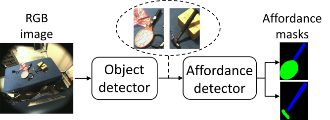

# An Affordance Detection Pipeline for Resource-Constrained Devices
This repository contains a demo of the pipeline described in the paper **"An Affordance Detection Pipeline for Resource-Constrained Devices"** by Apicella, T. et al.

A brief description of the method:
the object detector crops the objects of interest present in the scene and the affordance detector segments the patches pixel-wise in three classes: Background (black), Grasp (blue) and No-grasp (green).
Both object detector and affordance detector are lightweight models and have been trained on [IIT-AFF Dataset](https://sites.google.com/site/iitaffdataset/).

## Authors 
* Tommaso Apicella
* Andrea Cavallaro  
* Riccardo Berta  
* Paolo Gastaldo 
* Francesco Bellotti
* Edoardo Ragusa

## Table of contents
* [Python demo](#python-demo)
* [Reference](#reference)

## Python demo
### Requirements
The requirements to run the python code are the following:
* Python 3.6
* Tensorflow 
* Keras 
* Numpy
* OpenCV
* Keras segmentation 

For additional details, see *requirements.txt* file.

### Description
The `demo_object_detection_affordance.py` runs the pipeline described in the **paper** on a mp4 video.
The object detector SavedModel format is in *object_detector* folder, while affordance detector weights and config files are available in *affordance_detector* folder.

## Reference
If you find the code or pre-trained models useful, please cite the following paper:

**An Affordance Detection Pipeline for Resource-Constrained Devices.** , T. Apicella, A. Cavallaro, R. Berta, P. Gastaldo, and E. Ragusa. IEEE International Conference on Electronics, Circuits, and Systems (ICECS), 2021. [DOI](https://doi.org/10.1109/ICECS53924.2021.9665447)

    @inproceedings{apicella2021affordance,
      title={An Affordance Detection Pipeline for Resource-Constrained Devices},
      author={Apicella, Tommaso and Cavallaro, Andrea and Berta, Riccardo and Gastaldo, Paolo and Bellotti, Francesco and Ragusa, Edoardo},
      booktitle={2021 28th IEEE International Conference on Electronics, Circuits, and Systems (ICECS)},
      pages={1--6},
      organization={IEEE}
    }
